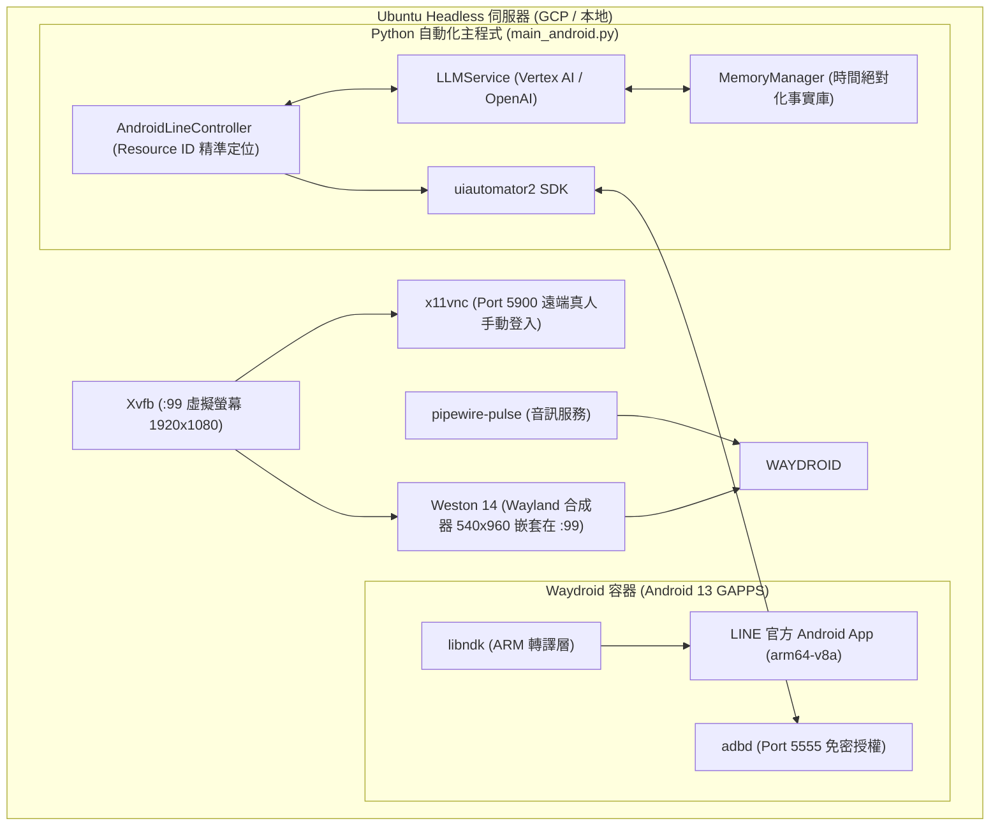

# LINE Android 原生智慧自動回覆機器人 (LINE Android Auto-Reply Bot)

本專案使用 Python 與 **`uiautomator2`** 開發，專為在 **Linux / Ubuntu (Headless 雲端伺服器 / 本地)** 上的 **Waydroid (Android 13)** 容器環境中運行官方 **LINE Android App** 所設計。

相較於先前的「桌面版 / Chrome 擴充套件 + OCR 視覺辨識 + 滑鼠座標模擬」方案，Android 原生模式具備 **100% UI 文字原生直讀、絕無滑鼠搶焦點、背景穩定運作、完全杜絕被動已讀** 等劃時代優勢。

---

## 🌟 核心優勢與亮點

### 1. 原生 UI 樹讀取（告別 OCR 誤判）
* **100% 精準文字**：直接存取 Android 系統級 Accessibility 與 UI 節點，訊息文字、Emoji、傳送者名稱皆為原始字串，不再受限於螢幕解析度、字型縮放或 Tesseract OCR 辨識錯字。
* **精準未讀徽章辨識**：直接讀取好友列上的數字紅點/綠點 Badge，並自動過濾時間標籤（如 `12:11 am`、`下午 5:10`）與底部導航欄未讀總數干擾。

### 2. 點前原生白名單防護 (Zero-Click Whitelist) 🔥
* 機器人在聊天列表輪詢時，**先檢驗好友名稱是否在白名單內**。
* **非白名單聯絡人/群組 ➡️ 100% 絕對不點擊進入！**
* 手機端與伺服器將永久保持原生未讀紅點，絕不造成真人漏接或被動已讀。

### 3. 多好友獨立 Persona 與雙 LLM 智慧備援
* **主模型**：Google Vertex AI / Gemini (`gemini-3.6-flash`)
* **備用模型**：OpenAI API / 相容模型 (`agnes-2.0-flash` / `gpt-4o-mini`)
* 支援針對不同好友或群組設定專屬 Prompt（繁體中文、英文、泰文、語氣風格等）。

### 4. 長遠事實記憶與「時間絕對化 (Temporal Grounding)」🔥
* **個人化長期事實檔案**：自動為每位好友建立專屬的長期記憶檔案（`logs/memories/<好友名稱>.json`）。
* **時間絕對化錨定 (Temporal Grounding)**：
  * **解決相對時間漂移痛點**：日常對話常包含「下週四要面試」、「明天看展覽」等相對時間詞彙，若直接記錄，過幾天後 LLM 會誤以為是未來的下週四。
  * **自動推算絕對日期**：提煉記憶時自動注入【當前對話基準時間】（含星期），強制 LLM 換算為具體絕對日期（例如：`預計於 2026-09-10 (四) 至 Supermicro 面試 BMC 相關職位`）。
  * **生成時序對齊**：回覆模型時注入當前系統時間，使 AI 能精準識別該事件是「已過期」、「今天發生」或「即將到來」，實現主動且自然的關心。
* **背景非同步 Thread 提煉**：訊息發送後立即於背景執行緒提取記憶，主迴圈花費 0 毫秒等待，完全不拖慢 LINE 介面的回覆與監聽速度。

### 5. Telegram 秘書推播 (`TelegramNotifier`)
* 異常報警、訊息發送失敗時第一時間推播。

---

## 🏛️ 系統運作架構



---

## 🔍 精準 UI 辨識與去重簽章機制

### 1. 原生 Resource ID 節點定位（排除外層容器干擾）
LINE Android 的 RecyclerView 聊天清單中，外層存在一個高度 684px 的列表容器（Row 0），若未過濾會將下方所有好友的文字與未讀紅點混雜，導致誤判「幽靈未讀」。
本系統透過專屬 Resource ID 進行精準定位，確保 100% 穩定性：
* **好友/群組名稱**：`jp.naver.line.android:id/name`
* **真實最新預覽內容**：`jp.naver.line.android:id/last_message`
* **發送時間/日期**：`jp.naver.line.android:id/date`
* **未讀數字計數**：`jp.naver.line.android:id/unread_message_count` 或 `square_chat_unread_message_count`

### 2. 簽章去重演算法 (Signature Deduplication)
```python
sig = f"{name}::{date_str}::{last_msg}"
```
* 結合「好友名稱」、「發送時間戳記」與「真正的最新訊息文字」。
* 當對方在同一分鐘發布新訊息時，由於內容變更，簽章自動更新，確保新訊息立即被觸發回覆。
* 成功發送、判定 `[NO_REPLY]` 或通話事件後自動記入記憶體集合，絕不重複打擾。

### 3. 通話/視訊事件自動處理
自動辨識語音通話（Voice call）、視訊通話（Video call）、未接來電與通話時長事件，機器人會自動進入聊天室消除紅點後返回，避免因未讀紅點未消除而產生無限循環。

---

## 🚀 快速開始 (Quick Start)

### 步驟 1：事前啟動環境（冷啟動 SOP）
若伺服器重新開機，執行已封裝好的一鍵啟動腳本：
```bash
./scripts/start_waydroid_env.sh
```
> 此腳本會依序啟動：`Xvfb :99` ➡️ `x11vnc` ➡️ `pipewire-pulse` ➡️ `Weston (540x960)` ➡️ `Waydroid Session` ➡️ `ADB 自動授權連線` ➡️ 拉起 Android 手機 UI。

*(如果伺服器本來就在運行中，且 Waydroid Session 已在線，則無須重複執行此步驟。)*

### 步驟 2：安裝 LINE App (ARM64 官方 APK)
若尚未安裝 LINE，可直接執行安裝輔助腳本：
```bash
./scripts/install_line_apk.sh ./scripts/line-15.21.3.apk
```

### 步驟 3：透過 VNC 完成首次真人登入
1. 使用任何 VNC 客戶端（如 RealVNC Viewer、TightVNC）連線至伺服器的 `5900` 埠。
2. 在畫面中點開 LINE App。
3. 使用手機號碼或 QR Code 完成登入驗證。

### 步驟 4：設定白名單與 Prompt (`config.yaml`)
開啟 `config.yaml`，確認 `bot.whitelist` 包含您要自動回覆的對象：
```yaml
bot:
  my_name: "HonJay Ding"
  whitelist:
    - "丁竑福"
    - "AutoReply"
    - "Eyeyupy"
  
  default_system_prompt: |
    你是我（{my_name}）的 LINE AI 助理。請親切自然地回覆對方最新訊息。

  contact_prompts:
    "Eyeyupy": |
      She is my girlfriend, only English or Thai language. Romantic and caring tone.
```

### 步驟 5：啟動自動回覆機器人 (手動前景模式)
```bash
.venv/bin/python main_android.py
```

---

## ⚙️ 開機自動啟動與 Systemd 背景常駐守護

專案中已備妥兩套標準的 Systemd 服務單元（放置於 `/etc/systemd/system/`），可實現伺服器開機全自動啟動與崩潰自癒重啟：

### 1. 服務層級依賴關係
```text
systemd (multi-user.target)
   └── waydroid-container.service (底層 LXC Android 容器)
          └── waydroid-desktop.service (虛擬桌面、Weston、Session、ADB)
                 └── line-bot-android.service (main_android.py 自動回覆主程式)
```

### 2. 一鍵啟用開機自動啟動
請在終端機執行以下指令啟用服務：
```bash
sudo systemctl daemon-reload
sudo systemctl enable waydroid-desktop.service line-bot-android.service
```

### 3. 服務日常管理指令
```bash
# 啟動服務 (注意：請先關閉前景執行的 main_android.py)
sudo systemctl start line-bot-android.service

# 停止服務
sudo systemctl stop line-bot-android.service

# 重新啟動服務
sudo systemctl restart line-bot-android.service

# 查看即時日誌 (即時監控對話與回覆輸出)
journalctl -u line-bot-android.service -f

# 檢查當前運行狀態
systemctl status line-bot-android.service
```

---

## 🔧 常見問答與維護技巧

### Q1: 如何確認 Waydroid 與 ADB 連線正常？
執行：
```bash
adb devices
```
正常輸出應顯示：
```text
List of devices attached
192.168.240.112:5555    device
```

### Q2: 為什麼看不到底部的返回鍵與 Home 鍵？
* Android 13 預設採用全螢幕手勢導航。一鍵開啟三大金剛按鈕：
  ```bash
  adb shell cmd overlay enable com.android.internal.systemui.navbar.threebutton
  ```
* 確保 Weston 尺寸設定為 `540x960`（已寫入 `start_waydroid_env.sh`），避免視窗高度超過螢幕被推擠裁切。

### Q3: 換到全新伺服器時該如何快速安裝？
請參考完整步驟 SOP 筆記：[docs/WAYDROID_LINE_SETUP_SOP.md](file:///home/dinghonjay/AutoReplyMessage/docs/WAYDROID_LINE_SETUP_SOP.md)。

