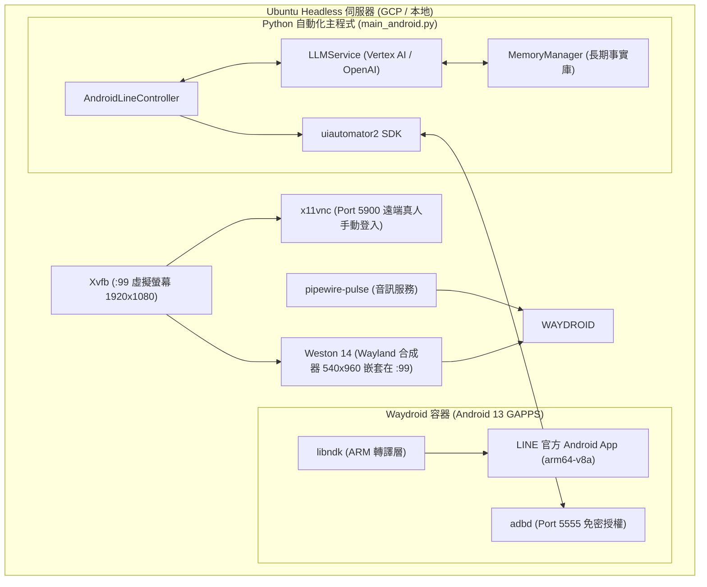

# LINE Android 原生智慧自動回覆機器人 (LINE Android Auto-Reply Bot)

本專案使用 Python 與 **`uiautomator2`** 開發，專為在 **Linux / Ubuntu (Headless 雲端伺服器 / 本地)** 上的 **Waydroid (Android 13)** 容器環境中運行官方 **LINE Android App** 所設計。

相較於先前的「桌面版 / Chrome 擴充套件 + OCR 視覺辨識 + 滑鼠座標模擬」方案，Android 原生模式具備 **100% UI 文字原生直讀、絕無滑鼠搶焦點、背景穩定運作、完全杜絕被動已讀** 等劃時代優勢。

---

## 🌟 核心優勢與亮點

### 1. 原生 UI 樹讀取（告別 OCR 誤判）
* **100% 精準文字**：直接存取 Android 系統級 Accessibility 與 UI 節點，訊息文字、Emoji、傳送者名稱皆為原始字串，不再受限於螢幕解析度、字型縮放或 Tesseract OCR 辨識錯字。
* **精準未讀徽章辨識**：直接讀取好友列上的數字紅點/綠點 Badge，並自動過濾時間標籤（如 `12:11 am`、`下午 5:10`）與底部導航欄未讀總數干擾。

### 2. 點前原生白名單防護 (Zero-Click Whitelist) 🔥
* 機器人在聊天列表輪詢時，**先檢驗好友名稱是否在白名單內**。
* **非白名單聯絡人/群組 ➡️ 100% 絕對不點擊進入！**
* 手機端與伺服器將永久保持原生未讀紅點，絕不造成真人漏接或被動已讀。

### 3. 多好友獨立 Persona 與雙 LLM 智慧備援
* **主模型**：Google Vertex AI / Gemini (`gemini-3.6-flash`)
* **備用模型**：OpenAI API / 相容模型 (`agnes-2.0-flash` / `gpt-4o-mini`)
* 支援針對不同好友或群組設定專屬 Prompt（繁體中文、英文、泰文、語氣風格等）。

### 4. 長遠事實與偏好記憶庫 (`MemoryManager`)
* 自動為每位好友建立專屬的長期記憶檔案（`logs/memories/<好友名稱>.json`）。
* 生成回覆時自動注入歷史事實與偏好；回覆送出後背景非同步更新事實庫。

### 5. Telegram 秘書推播 (`TelegramNotifier`)
* 異常報警、訊息發送失敗時第一時間推播。

---

## 🏛️ 系統運作架構



---

## 🚀 快速開始 (Quick Start)

### 步驟 1：啟動虛擬桌面與 Waydroid 環境
執行已封裝好的一鍵啟動腳本：
```bash
./scripts/start_waydroid_env.sh
```
> 此腳本會依序啟動：`Xvfb :99` ➡️ `x11vnc` ➡️ `pipewire-pulse` ➡️ `Weston (540x960)` ➡️ `Waydroid Session` ➡️ `ADB 自動授權連線` ➡️ 開啟 Android 畫面。

### 步驟 2：安裝 LINE App (ARM64 官方 APK)
若尚未安裝 LINE，可直接執行安裝輔助腳本：
```bash
./scripts/install_line_apk.sh ./scripts/line-15.21.3.apk
```

### 步驟 3：透過 VNC 完成首次真人登入
1. 使用任何 VNC 客戶端（如 RealVNC Viewer、TightVNC）連線至伺服器的 `5900` 埠。
2. 在畫面中點開 LINE App。
3. 使用手機號碼或 QR Code 完成登入驗證。

### 步驟 4：設定白名單與 Prompt (`config.yaml`)
開啟 `config.yaml`，確認 `bot.whitelist` 包含您要自動回覆的對象：
```yaml
bot:
  my_name: "HonJay Ding"
  whitelist:
    - "丁竑福"
    - "AutoReply"
    - "Eyeyupy"
  
  default_system_prompt: |
    你是我（{my_name}）的 LINE AI 助理。請親切自然地回覆對方最新訊息。

  contact_prompts:
    "Eyeyupy": |
      She is my girlfriend, only English or Thai language. Romantic and caring tone.
```

### 步驟 5：啟動自動回覆機器人
```bash
.venv/bin/python main_android.py
```

---

## 📂 專案檔案結構 (Android 模式)

```text
AutoReplyMessage/
├── README.md                      # 原有的桌面版/Chrome擴充套件版文件
├── README_ANDROID.md              # 【本文件】Waydroid Android 模式說明
├── config.yaml                    # 全域設定檔（模型金鑰、白名單、Prompt）
├── main_android.py                # Android 模式主程式 (啟動入口)
│
├── core/
│   ├── android_line_controller.py # uiautomator2 Android 原生 LINE 控制器
│   ├── llm_service.py             # Vertex AI (主) / OpenAI (備) 智慧生成模組
│   ├── memory_manager.py          # 好友長遠事實與偏好記憶持久化
│   ├── notifier.py                # Telegram 推播與異常通報
│   └── chat_logger.py             # 輪轉式 Log 與失敗封包歸檔
│
├── scripts/
│   ├── start_waydroid_env.sh      # 一鍵啟動 Weston + Waydroid + ADB 環境
│   ├── stop_waydroid_env.sh       # 一鍵安全停止 Waydroid 與 Weston
│   ├── install_line_apk.sh        # 一鍵安裝 APK 輔助腳本
│   ├── waydroid-desktop.service   # Systemd 桌面環境常駐服務
│   └── line-bot-android.service   # Systemd 機器人常駐服務
│
└── docs/
    └── WAYDROID_LINE_SETUP_SOP.md # 全新機器環境安裝與踩坑詳細 SOP 筆記
```

---

## ⚙️ 常駐為系統背景服務 (Systemd)

若希望主機開機後自動就緒並常駐運行，可啟用以下兩個 Systemd 服務：

### 1. 啟用 Waydroid + Weston 桌面環境常駐
```bash
sudo systemctl enable --now waydroid-desktop.service
```

### 2. 啟用 LINE Android 自動回覆機器人常駐
```bash
sudo systemctl enable --now line-bot-android.service
```

### 服務狀態檢查與日誌
```bash
# 檢查機器人運作狀態
systemctl status line-bot-android.service

# 查看即時日誌
journalctl -u line-bot-android.service -f
```

---

## 🔧 常見問答與維護技巧

### Q1: 如何確認 Waydroid 與 ADB 連線正常？
執行：
```bash
adb devices
```
正常輸出應顯示：
```text
List of devices attached
192.168.240.112:5555    device
```

### Q2: 為什麼看不到底部的返回鍵與 Home 鍵？
* Android 13 預設採用全螢幕手勢導航。一鍵開啟三大金剛按鈕：
  ```bash
  adb shell cmd overlay enable com.android.internal.systemui.navbar.threebutton
  ```
* 確保 Weston 尺寸設定為 `540x960`（已寫入 `start_waydroid_env.sh`），避免視窗高度超過螢幕被推擠裁切。

### Q3: 換到全新伺服器時該如何快速安裝？
請參考完整步驟 SOP 筆記：[docs/WAYDROID_LINE_SETUP_SOP.md](file:///home/dinghonjay/AutoReplyMessage/docs/WAYDROID_LINE_SETUP_SOP.md)。
